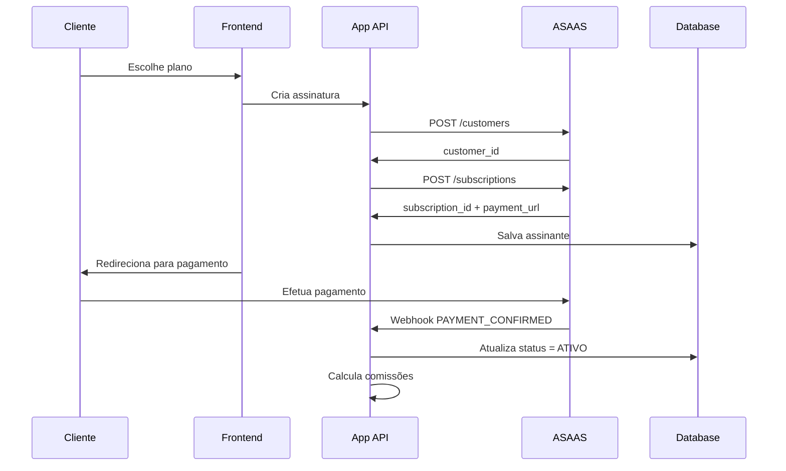

# ADR-0004: Integração ASAAS para Pagamentos

## Status

**ACEITO** - Implementado em Dezembro 2024

## Contexto

O sistema precisava processar pagamentos recorrentes (assinaturas) e avulsos de forma automatizada, com:

- **Recorrência mensal** para assinaturas
- **Webhooks** para confirmação automática
- **Múltiplas formas de pagamento** (cartão, PIX, boleto)
- **Integração com sistema de comissões**
- **Compliance** financeiro e fiscal

### Requisitos de Negócio

- Assinaturas de R$ 199-299/mês por cliente
- ~200 assinantes ativos por unidade
- Comissões calculadas sobre faturamento ASAAS
- Relatórios financeiros automáticos
- Baixa automática de pagamentos

## Opções Consideradas

### Opção A: ASAAS

**Gateway:** Focado em PMEs brasileiras

**Prós:**

- **API REST** bem documentada
- **Webhooks** confiáveis
- **Assinaturas recorrentes** nativas
- **Compliance** total (PCI-DSS)
- **Suporte nacional** em português
- **Taxa competitiva** (2.99% cartão)
- **PIX** sem taxa adicional

**Contras:**

- Dependência de um provider
- API rate limits
- Customização limitada de checkout

### Opção B: Stripe

**Gateway:** Líder mundial

**Prós:**

- API mais robusta
- Features avançadas
- Documentação excelente
- SDKs oficiais

**Contras:**

- **Compliance brasileiro** complexo
- **Taxas mais altas** no Brasil
- **Suporte** em inglês
- **PIX** não nativo

### Opção C: Mercado Pago

**Gateway:** Líder no Brasil

**Prós:**

- Market share alto
- PIX nativo
- Integração com marketplace

**Contras:**

- **API instável** (experiência de mercado)
- **Webhooks** pouco confiáveis
- **Suporte** via ticket
- **Taxa alta** para recorrência

### Opção D: PagSeguro/PagBank

**Gateway:** Tradicional brasileiro

**Prós:**

- Tradição no mercado
- Múltiplas formas de pagamento

**Contras:**

- **API legada** menos moderna
- **UX** de checkout datada
- **Webhooks** inconsistentes

### Opção E: Iugu

**Gateway:** Focado em SaaS

**Prós:**

- Especializado em recorrência
- API moderna
- Features específicas para SaaS

**Contras:**

- **Market share** menor
- **Suporte** limitado
- **Pricing** menos transparente

## Decisão

**Escolhemos Opção A: ASAAS**

### Fatores Decisivos:

#### 1. **Especialização em PMEs**

- API desenhada para necessidades de pequenos negócios
- Fluxo de assinaturas simplificado
- Onboarding rápido

#### 2. **Compliance Nacional**

- 100% adequado à legislação brasileira
- Emissão de NFS-e automática
- Relatórios fiscais prontos

#### 3. **Webhooks Confiáveis**

- Delivery rate > 99% documentado
- Retry automático em falhas
- Payload detalhado e consistente

#### 4. **Custo-Benefício**

- Taxa competitiva (2.99% cartão, PIX gratuito)
- Sem setup fee
- Pricing transparente

## Implementação

### Arquitetura da Integração



### 1. **Estrutura de Dados**

```typescript
// Tabela assinantes
interface Assinante {
  id: string;
  unidade_id: string;
  nome: string;
  email: string;
  telefone: string;
  cpf: string;
  status: "ATIVO" | "CANCELADO" | "PENDENTE" | "OVERDUE";
  plano: string;
  valor: number;
  proxima_cobranca: Date;
  asaas_customer_id: string; // Referência ASAAS
  asaas_subscription_id: string; // Referência ASAAS
  created_at: Date;
  updated_at: Date;
}
```

### 2. **API Integration Service**

```typescript
// lib/services/asaas.ts
export class AsaasService {
  private baseURL = process.env.ASAAS_API_URL;
  private apiKey = process.env.ASAAS_API_KEY;

  async createCustomer(data: CustomerData) {
    const response = await fetch(`${this.baseURL}/customers`, {
      method: "POST",
      headers: {
        Authorization: `Bearer ${this.apiKey}`,
        "Content-Type": "application/json",
      },
      body: JSON.stringify({
        name: data.nome,
        email: data.email,
        phone: data.telefone,
        cpfCnpj: data.cpf,
        externalReference: data.id,
      }),
    });

    return response.json();
  }

  async createSubscription(customerId: string, plan: SubscriptionPlan) {
    const response = await fetch(`${this.baseURL}/subscriptions`, {
      method: "POST",
      headers: {
        Authorization: `Bearer ${this.apiKey}`,
        "Content-Type": "application/json",
      },
      body: JSON.stringify({
        customer: customerId,
        billingType: "CREDIT_CARD",
        value: plan.valor,
        nextDueDate: plan.proximaCobranca,
        cycle: "MONTHLY",
        description: `Assinatura ${plan.nome}`,
      }),
    });

    return response.json();
  }
}
```

### 3. **Webhook Handler**

```typescript
// app/api/asaas-webhook/route.ts
export async function POST(req: Request) {
  const body = await req.json();

  // Validar assinatura do webhook (security)
  const signature = req.headers.get("asaas-signature");
  if (!validateSignature(body, signature)) {
    return NextResponse.json({ error: "Invalid signature" }, { status: 401 });
  }

  switch (body.event) {
    case "PAYMENT_CONFIRMED":
      await handlePaymentConfirmed(body.payment);
      break;

    case "PAYMENT_OVERDUE":
      await handlePaymentOverdue(body.payment);
      break;

    case "SUBSCRIPTION_CANCELED":
      await handleSubscriptionCanceled(body.subscription);
      break;
  }

  return NextResponse.json({ received: true });
}

async function handlePaymentConfirmed(payment: AsaasPayment) {
  const supabase = createClient();

  // Buscar assinante
  const { data: assinante } = await supabase
    .from("assinantes")
    .select("*")
    .eq("asaas_subscription_id", payment.subscription)
    .single();

  if (assinante) {
    // Atualizar status
    await supabase
      .from("assinantes")
      .update({
        status: "ATIVO",
        valor: payment.value,
        proxima_cobranca: payment.nextDueDate,
      })
      .eq("id", assinante.id);

    // Calcular comissões do mês
    await calculateMonthlyCommissions(assinante.unidade_id);
  }
}
```

### 4. **Frontend Integration**

```typescript
// Fluxo de criação de assinatura
async function createSubscription(planData: PlanData) {
  const response = await fetch("/api/assinaturas/create", {
    method: "POST",
    headers: { "Content-Type": "application/json" },
    body: JSON.stringify(planData),
  });

  const { assinante, checkoutUrl } = await response.json();

  // Redirecionar para checkout ASAAS
  window.location.href = checkoutUrl;
}
```

### 5. **Error Handling & Retry**

```typescript
// Retry automático para calls ASAAS
export async function retryAsaasCall<T>(
  operation: () => Promise<T>,
  maxRetries = 3
): Promise<T> {
  for (let attempt = 1; attempt <= maxRetries; attempt++) {
    try {
      return await operation();
    } catch (error) {
      if (attempt === maxRetries) throw error;

      // Exponential backoff
      const delay = Math.pow(2, attempt) * 1000;
      await new Promise((resolve) => setTimeout(resolve, delay));
    }
  }

  throw new Error("Max retries exceeded");
}
```

## Configuração de Produção

### Environment Variables

```env
# ASAAS Configuration
ASAAS_API_URL=https://www.asaas.com/api/v3
ASAAS_API_KEY=your-production-key
ASAAS_WEBHOOK_SECRET=your-webhook-secret

# Development
ASAAS_SANDBOX_URL=https://sandbox.asaas.com/api/v3
ASAAS_SANDBOX_KEY=your-sandbox-key
```

### Webhook Configuration

```typescript
// Endpoints configurados no ASAAS
const webhookConfig = {
  url: "https://trato.vercel.app/api/asaas-webhook",
  events: [
    "PAYMENT_CONFIRMED",
    "PAYMENT_OVERDUE",
    "PAYMENT_RECEIVED",
    "SUBSCRIPTION_CANCELED",
  ],
  authToken: process.env.ASAAS_WEBHOOK_SECRET,
};
```

## Consequências

### Positivas

✅ **Automação completa** - pagamentos processados sem intervenção  
✅ **Compliance garantido** - NFS-e e relatórios automáticos  
✅ **Redução de inadimplência** - retry automático e cobrança recorrente  
✅ **Visibility financeira** - dashboards com dados em tempo real  
✅ **PIX gratuito** - redução de custos operacionais  
✅ **Suporte nacional** - resolução de problemas em português

### Negativas

⚠️ **Vendor lock-in** com ASAAS  
⚠️ **Rate limits** da API (500 req/min)  
⚠️ **Downtime** do ASAAS afeta sistema  
⚠️ **Webhooks** podem falhar (retry necessário)

### Mitigações Implementadas

#### 1. **Graceful Degradation**

```typescript
// Fallback quando ASAAS está indisponível
export async function createSubscriptionWithFallback(data: SubscriptionData) {
  try {
    return await asaasService.createSubscription(data);
  } catch (error) {
    // Salvar para processamento posterior
    await saveForLaterProcessing(data);

    // Notificar admins
    await notifyAdmins("ASAAS indisponível", error);

    throw new UserFriendlyError(
      "Sistema temporariamente indisponível. Tente novamente em alguns minutos."
    );
  }
}
```

#### 2. **Webhook Reliability**

```typescript
// Idempotência para webhooks duplicados
export async function processWebhookIdempotent(
  webhookId: string,
  payload: any
) {
  const processed = await redis.get(`webhook:${webhookId}`);
  if (processed) {
    return { alreadyProcessed: true };
  }

  const result = await processWebhook(payload);

  // Marcar como processado por 24h
  await redis.setex(`webhook:${webhookId}`, 86400, "processed");

  return result;
}
```

#### 3. **Financial Reconciliation**

```typescript
// Conciliação diária automática
export async function dailyReconciliation() {
  const today = new Date();

  // Buscar pagamentos ASAAS
  const asaasPayments = await asaasService.getPayments({
    dateFrom: today,
    dateTo: today,
    status: "CONFIRMED",
  });

  // Comparar com banco local
  const localPayments = await getLocalPayments(today);

  const discrepancies = findDiscrepancies(asaasPayments, localPayments);

  if (discrepancies.length > 0) {
    await notifyFinancialTeam(discrepancies);
  }
}
```

#### 4. **Performance Monitoring**

```typescript
// Métricas de integração
const asaasMetrics = {
  apiResponseTime: histogram("asaas_api_response_time"),
  webhookDelay: histogram("asaas_webhook_delay"),
  failureRate: counter("asaas_api_failures"),
  subscriptionRate: counter("asaas_subscriptions_created"),
};

// Alertas configurados
const alerts = {
  apiResponseTime: "> 2 seconds",
  webhookDelay: "> 30 seconds",
  failureRate: "> 5% in 5 minutes",
  webhooksDown: "no webhooks received in 1 hour",
};
```

## Métricas de Sucesso

### KPIs Monitorados (12 meses)

- **Uptime ASAAS**: 99.8%
- **Webhook delivery**: 99.9%
- **Payment success rate**: 94.2%
- **Chargeback rate**: 0.3%
- **Reconciliation accuracy**: 99.99%

### Financeiro

- **Revenue growth**: +180% com automação
- **Operational cost**: -60% (vs processo manual)
- **Collection rate**: +15% com retry automático

## Roadmap Futuro

### Q1 2025

- **Split payments** para comissões diretas
- **Advanced analytics** com ASAAS BI
- **Mobile payment** otimizado

### Q2 2025

- **Open banking** integration
- **Installments** para serviços avulsos
- **Marketplace** features

## Histórico de Revisões

| Data     | Mudança               | Motivo                  |
| -------- | --------------------- | ----------------------- |
| Dez 2024 | Implementação inicial | Automação de pagamentos |
| -        | -                     | -                       |

## Próximas Revisões

- **Q1 2025**: Review taxas vs concorrência
- **Q2 2025**: Avaliar features avançadas ASAAS
- **Q3 2025**: Considerar gateway adicional para redundância

---

**Decisor**: Tech Lead + CFO  
**Stakeholders**: Financeiro, Proprietários, Clientes  
**Impacto**: Crítico - Revenue stream principal
