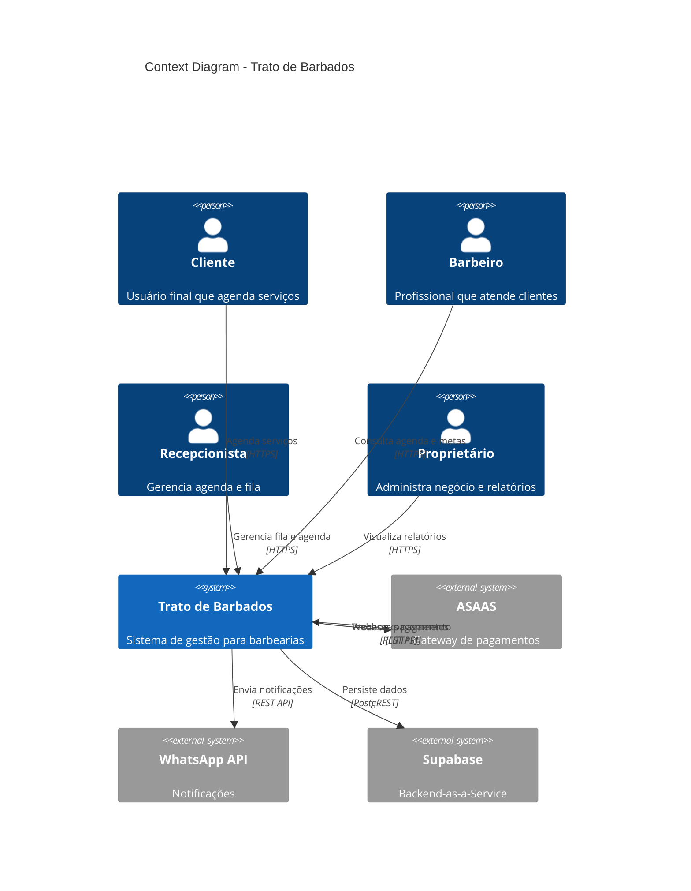
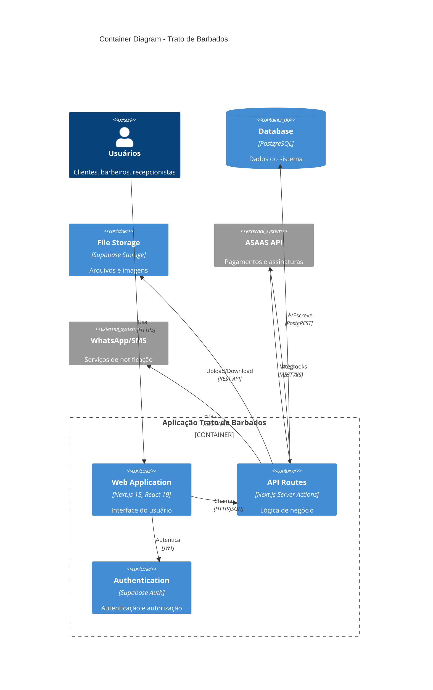
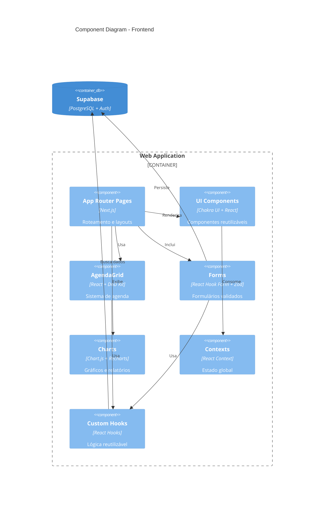
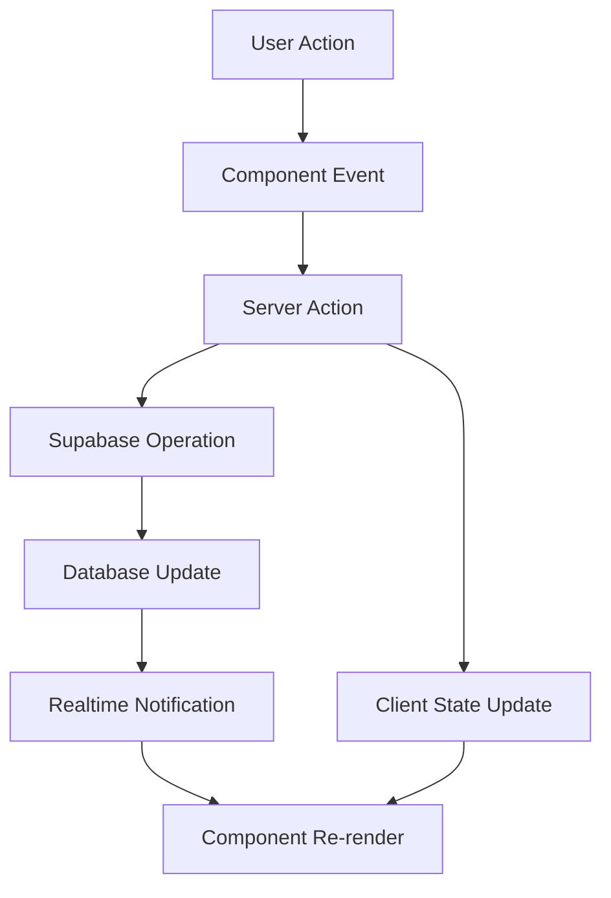
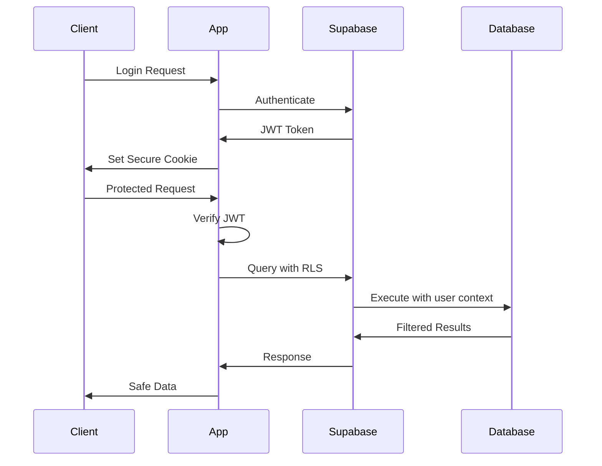
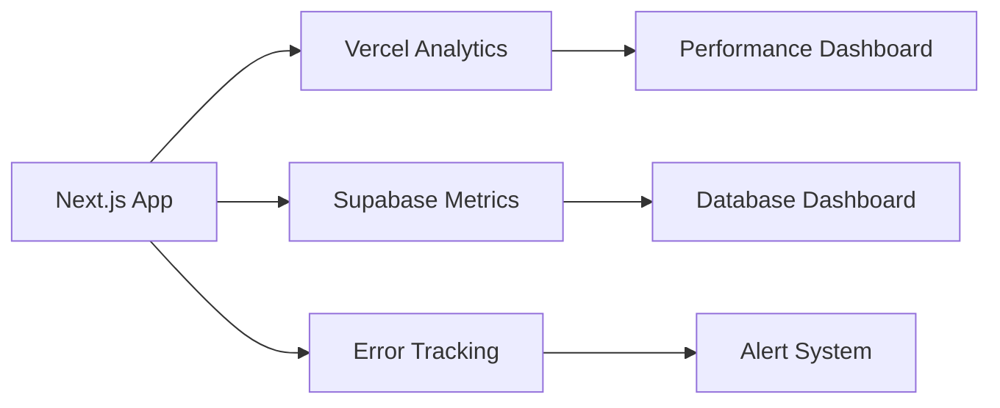

# 🏗️ Arquitetura do Sistema - Trato de Barbados

## 🎯 **Visão Arquitetural**

O sistema Trato de Barbados segue uma arquitetura **serverless híbrida** baseada em Next.js com Supabase como Backend-as-a-Service, utilizando padrões modernos de desenvolvimento React.

---

## 📐 **Diagrama C4 - Nível 1 (Context)**



---

## 📐 **Diagrama C4 - Nível 2 (Container)**



---

## 📐 **Diagrama C4 - Nível 3 (Component) - Frontend**



---

## 🔧 **Camadas da Aplicação**

### **1. Apresentação (Frontend)**

```
📁 app/                    # Next.js App Router
├── 📁 (auth)/            # Grupo de rotas de autenticação
├── 📁 agenda/            # Sistema de agendamentos
├── 📁 dashboard/         # Painéis administrativos
├── 📁 clientes/          # Gestão de clientes
├── 📁 assinaturas/       # Gestão de assinaturas
└── 📁 api/              # API Routes (Backend)

📁 components/            # Componentes reutilizáveis
├── 📁 ui/               # Componentes base (Chakra UI)
├── 📁 auth/             # Componentes de autenticação
├── 📁 layout/           # Layouts e navegação
└── 📁 forms/            # Formulários específicos
```

### **2. Lógica de Negócio (API Routes + Server Actions)**

```
📁 app/api/              # API Routes
├── 📁 auth/             # Autenticação
├── 📁 appointments/     # Agendamentos
├── 📁 asaas/           # Integração ASAAS
├── 📁 dashboard/       # Dados de dashboard
└── 📁 webhooks/        # Webhooks externos

📁 lib/                  # Lógica compartilhada
├── 📁 services/        # Serviços de integração
├── 📁 supabase/        # Cliente Supabase
└── 📁 utils/           # Utilitários
```

### **3. Dados (Supabase)**

```
🗄️ PostgreSQL           # Banco principal
├── 📊 Tables           # Tabelas do sistema
├── 🔒 RLS Policies     # Row Level Security
├── 🔍 Views            # Views materializadas
└── ⚡ Functions        # Stored procedures

🔐 Supabase Auth        # Sistema de autenticação
├── 👤 Users            # Usuários do sistema
├── 🎭 Roles            # Perfis e permissões
└── 🔑 Sessions         # Sessões ativas
```

---

## 🧩 **Padrões Arquiteturais**

### **1. Multi-tenancy com RLS**

```sql
-- Exemplo de política RLS
CREATE POLICY "Users can only see their unit data"
ON appointments FOR SELECT
USING (unidade_id = current_unidade());

-- Função para unidade atual
CREATE OR REPLACE FUNCTION current_unidade()
RETURNS UUID AS $$
BEGIN
  RETURN (current_setting('app.current_unidade', true))::UUID;
END;
$$ LANGUAGE plpgsql;
```

### **2. Component-Driven Development**

```typescript
// Estrutura padrão de componente
interface ComponentProps {
  // Props tipadas com TypeScript
}

export function Component({ prop }: ComponentProps) {
  // Hooks na ordem: estado, efeitos, callbacks
  const [state, setState] = useState();

  // Lógica de negócio extraída em hooks customizados
  const { data, loading } = useCustomHook();

  // JSX limpo com Chakra UI
  return <ChakraComponent>{/* Conteúdo */}</ChakraComponent>;
}
```

### **3. Server Actions Pattern**

```typescript
// app/actions/appointments.ts
"use server";

export async function createAppointment(data: CreateAppointmentData) {
  const supabase = await createClient();

  // Validação
  const validated = appointmentSchema.parse(data);

  // Lógica de negócio
  const result = await supabase.from("appointments").insert(validated);

  // Notificações
  await scheduleNotifications(result.data.id);

  return result;
}
```

### **4. State Management**

```typescript
// Context + Reducer pattern
const AppContext = createContext();

function AppProvider({ children }) {
  const [state, dispatch] = useReducer(appReducer, initialState);

  return (
    <AppContext.Provider value={{ state, dispatch }}>
      {children}
    </AppContext.Provider>
  );
}

// Custom hooks para encapsular lógica
function useAppointments() {
  const { state, dispatch } = useContext(AppContext);

  const createAppointment = useCallback(
    async (data) => {
      dispatch({ type: "CREATE_APPOINTMENT_START" });
      // ... lógica
    },
    [dispatch]
  );

  return { appointments: state.appointments, createAppointment };
}
```

---

## 🎨 **Design System Arquitetura**

### **Token-based Design**

```typescript
// theme/tokens.ts
export const tokens = {
  colors: {
    brand: {
      50: "#f0f9ff",
      500: "#3b82f6",
      900: "#1e3a8a",
    },
  },
  space: {
    1: "0.25rem",
    4: "1rem",
    // ...
  },
};

// Uso nos componentes
<Box p={4} bg="brand.50">
  <Text color="brand.900">Content</Text>
</Box>;
```

### **Component Composition**

```typescript
// Composição vs herança
function Card({ children, ...props }) {
  return <ChakraCard {...props}>{children}</ChakraCard>;
}

function CardHeader({ children }) {
  return <CardBody>{children}</CardBody>;
}

// Uso
<Card>
  <CardHeader>Title</CardHeader>
  <CardBody>Content</CardBody>
</Card>;
```

---

## 🔄 **Fluxo de Dados**

### **Unidirecional com Server State**



### **Error Boundaries**

```typescript
class ErrorBoundary extends Component {
  constructor(props) {
    super(props);
    this.state = { hasError: false };
  }

  static getDerivedStateFromError(error) {
    return { hasError: true };
  }

  componentDidCatch(error, errorInfo) {
    console.error("Error caught by boundary:", error, errorInfo);
    // Log to monitoring service
  }

  render() {
    if (this.state.hasError) {
      return <ErrorFallback />;
    }

    return this.props.children;
  }
}
```

---

## 🔐 **Segurança Arquitetural**

### **Autenticação Multi-layer**



### **RLS Implementation**

```sql
-- Política para agendamentos
CREATE POLICY "appointment_access" ON appointments
FOR ALL
USING (
  unidade_id = current_unidade() AND
  (
    barbeiro_id = auth.uid() OR           -- Barbeiro vê seus agendamentos
    cliente_id = auth.uid() OR            -- Cliente vê seus agendamentos
    EXISTS (                              -- Admin/Recepcionista vê todos
      SELECT 1 FROM profiles
      WHERE id = auth.uid()
      AND role IN ('admin', 'barbershop_owner', 'recepcionista')
    )
  )
);
```

---

## ⚡ **Performance e Otimização**

### **Code Splitting**

```typescript
// Lazy loading de páginas pesadas
const AgendaPage = lazy(() => import("./agenda/page"));
const DashboardPage = lazy(() => import("./dashboard/page"));

// Suspense boundaries
<Suspense fallback={<Loading />}>
  <AgendaPage />
</Suspense>;
```

### **Data Fetching Strategy**

```typescript
// Server-side rendering para SEO
export async function generateStaticParams() {
  return [{ slug: "trato" }, { slug: "barberbeer" }];
}

// Client-side com React Query (inferido)
function useAppointments(date: Date) {
  return useSWR(["appointments", date], () => fetchAppointments(date), {
    revalidateOnFocus: false,
  });
}
```

### **Database Optimization**

```sql
-- Índices estratégicos
CREATE INDEX CONCURRENTLY idx_appointments_barbeiro_date
ON appointments(barbeiro_id, DATE(start_at));

CREATE INDEX CONCURRENTLY idx_appointments_search
ON appointments USING GIN(to_tsvector('portuguese', observacoes));

-- Views materializadas para relatórios
CREATE MATERIALIZED VIEW vw_monthly_revenue AS
SELECT
  DATE_TRUNC('month', created_at) as month,
  SUM(valor) as total_revenue
FROM assinantes
WHERE status = 'ATIVO'
GROUP BY month;
```

---

## 🔧 **DevOps e Deploy**

### **Build Pipeline**

```yaml
# .github/workflows/deploy.yml (inferido)
name: Deploy
on:
  push:
    branches: [main]

jobs:
  deploy:
    runs-on: ubuntu-latest
    steps:
      - uses: actions/checkout@v3
      - uses: actions/setup-node@v3
      - run: npm ci
      - run: npm run build
      - run: npm run test
      - uses: vercel/action@v1
```

### **Monitoring Architecture**



---

## ⚠️ **Pontos de Atenção Arquiteturais**

### **Débitos Técnicos**

- **Cache Layer**: Falta implementação de cache Redis/Memcached
- **Event Sourcing**: Não há auditoria de mudanças críticas
- **Message Queue**: Notificações são síncronas (pode travar)
- **CDN**: Assets não estão em CDN dedicado

### **Riscos**

- **Single Point of Failure**: Dependência total do Supabase
- **Rate Limiting**: Não há proteção contra DDoS
- **Data Backup**: Estratégia de backup não documentada
- **Disaster Recovery**: Plano de recuperação não implementado

### **Melhorias Recomendadas**

1. **Implementar Circuit Breaker** para integrações externas
2. **Adicionar observability** com OpenTelemetry
3. **Criar strategy de cache** multi-layer
4. **Implementar feature flags** para releases graduais

---

**Última atualização**: Dezembro 2024  
**Versão**: 1.0  
**Arquiteto**: Time de Desenvolvimento
