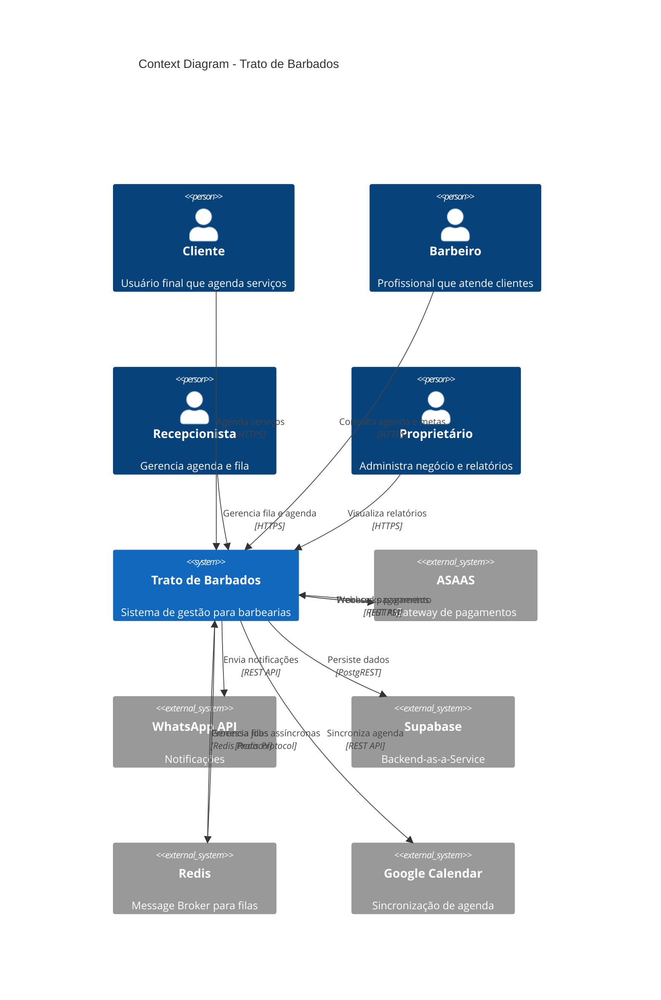
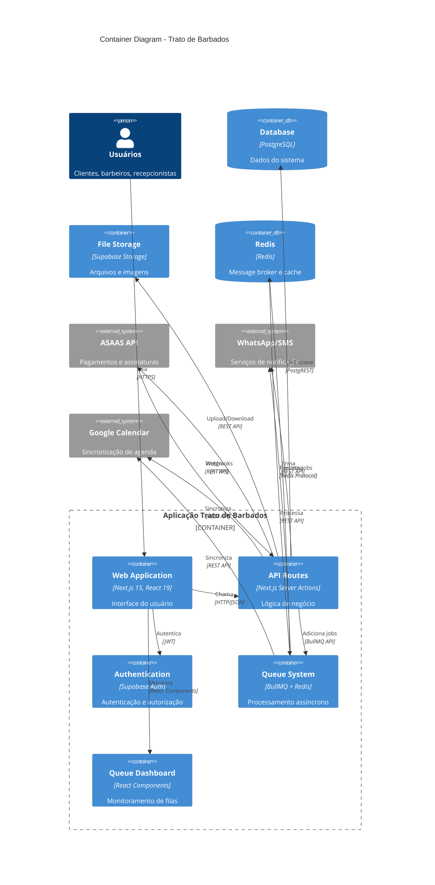
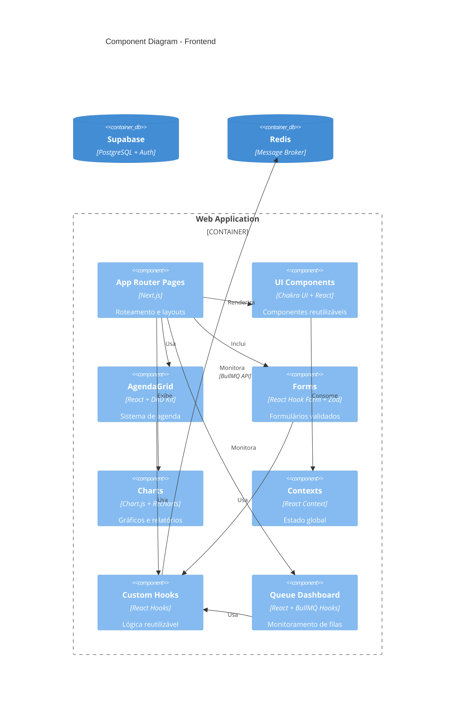
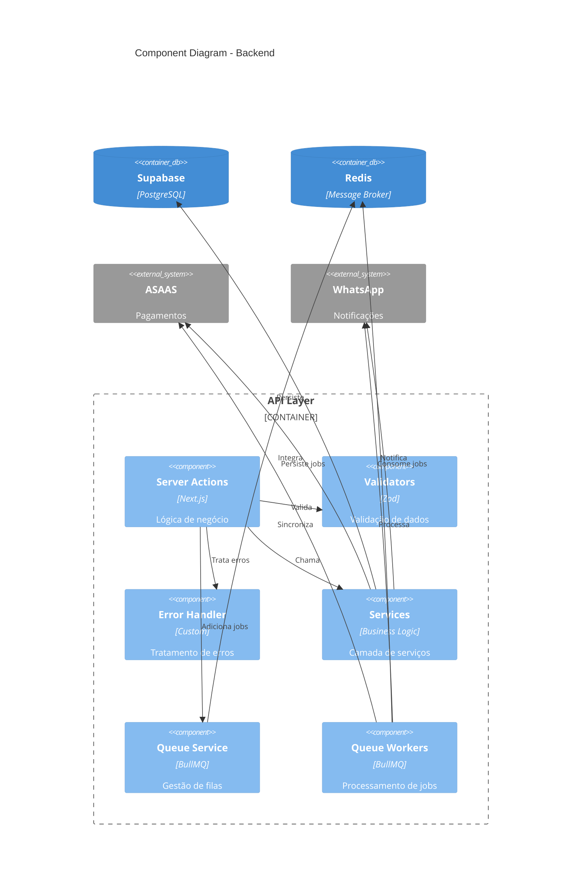

# 🏗️ Arquitetura do Sistema - Trato de Barbados

## 🎯 **Visão Arquitetural**

O sistema Trato de Barbados segue uma arquitetura **serverless híbrida** baseada em Next.js com Supabase como Backend-as-a-Service, utilizando padrões modernos de desenvolvimento React e um sistema robusto de filas assíncronas com BullMQ.

---

## 📐 **Diagrama C4 - Nível 1 (Context)**



---

## 📐 **Diagrama C4 - Nível 2 (Container)**



---

## 📐 **Diagrama C4 - Nível 3 (Component) - Frontend**



---

## 📐 **Diagrama C4 - Nível 3 (Component) - Backend**



---

## 🏗️ **Arquitetura de Camadas**

### **1. Camada de Apresentação (Presentation Layer)**

```
┌─────────────────────────────────────────────────────────────┐
│                    Frontend (Next.js)                      │
├─────────────────────────────────────────────────────────────┤
│ • Pages (App Router)                                       │
│ • Components (Chakra UI + React)                           │
│ • Hooks Customizados                                       │
│ • Contexts (Estado Global)                                 │
│ • Queue Dashboard (Monitoramento)                          │
└─────────────────────────────────────────────────────────────┘
```

### **2. Camada de API (API Layer)**

```
┌─────────────────────────────────────────────────────────────┐
│                   Server Actions                           │
├─────────────────────────────────────────────────────────────┤
│ • Controllers de Negócio                                   │
│ • Validação com Zod                                        │
│ • Tratamento de Erros                                      │
│ • Autenticação/Autorização                                 │
└─────────────────────────────────────────────────────────────┘
```

### **3. Camada de Serviços (Service Layer)**

```
┌─────────────────────────────────────────────────────────────┐
│                    Business Services                       │
├─────────────────────────────────────────────────────────────┤
│ • AppointmentService (Agendamentos)                       │
│ • PaymentService (Pagamentos ASAAS)                       │
│ • NotificationService (Notificações)                      │
│ • ReportService (Relatórios)                              │
│ • QueueService (Sistema de Filas)                         │
└─────────────────────────────────────────────────────────────┘
```

### **4. Camada de Dados (Data Layer)**

```
┌─────────────────────────────────────────────────────────────┐
│                      Data Access                          │
├─────────────────────────────────────────────────────────────┤
│ • Supabase Client (PostgreSQL)                            │
│ • Redis Client (Message Broker)                           │
│ • Storage Client (Arquivos)                               │
│ • Queue Client (BullMQ)                                   │
└─────────────────────────────────────────────────────────────┘
```

---

## 🚀 **Sistema de Filas (Queue System)**

### **Arquitetura das Filas**

```
┌─────────────────────────────────────────────────────────────┐
│                    Queue System                            │
├─────────────────────────────────────────────────────────────┤
│ • Notification Queue (Alta Prioridade)                     │
│ • Report Queue (Média Prioridade)                          │
│ • Cleanup Queue (Baixa Prioridade)                         │
│ • Sync Queue (Média Prioridade)                            │
└─────────────────────────────────────────────────────────────┘
```

### **Fluxo de Processamento**

```
1. Job Creation → 2. Queue Storage → 3. Worker Processing → 4. Result Storage
     ↓                    ↓                    ↓                    ↓
Server Action         Redis (BullMQ)      Queue Workers        Database/Logs
```

### **Componentes das Filas**

- **Queues**: Instâncias BullMQ para diferentes tipos de tarefas
- **Workers**: Processadores de jobs com retry automático
- **Scheduler**: Agendamento de tarefas recorrentes
- **Dashboard**: Interface de monitoramento em tempo real
- **Hooks**: Integração React com o sistema de filas

---

## 🔐 **Segurança e Autenticação**

### **Row Level Security (RLS)**

```
┌─────────────────────────────────────────────────────────────┐
│                    RLS Policies                           │
├─────────────────────────────────────────────────────────────┤
│ • users: can_read_own_profile()                           │
│ • appointments: can_manage_own_unit()                      │
│ • payments: can_access_own_unit()                          │
│ • reports: can_view_own_unit()                             │
└─────────────────────────────────────────────────────────────┘
```

### **Autenticação Multi-nível**

```
┌─────────────────────────────────────────────────────────────┐
│                  Auth Levels                               │
├─────────────────────────────────────────────────────────────┤
│ • Public Routes (Landing, Login)                          │
│ • Protected Routes (Dashboard, Agenda)                     │
│ • Role-based Routes (Admin, Reports)                       │
│ • Unit-based Access (Multi-tenant)                         │
└─────────────────────────────────────────────────────────────┘
```

---

## 📊 **Monitoramento e Observabilidade**

### **Sistema de Logs**

```
┌─────────────────────────────────────────────────────────────┐
│                    Logging Strategy                        │
├─────────────────────────────────────────────────────────────┤
│ • Application Logs (Console + File)                        │
│ • Error Logs (Structured + Context)                        │
│ • Queue Logs (Job processing + Metrics)                    │
│ • Audit Logs (User actions + Changes)                      │
└─────────────────────────────────────────────────────────────┘
```

### **Métricas de Performance**

```
┌─────────────────────────────────────────────────────────────┐
│                    Performance Metrics                     │
├─────────────────────────────────────────────────────────────┤
│ • Queue Health (Jobs waiting, active, failed)              │
│ • Response Times (API endpoints)                           │
│ • Database Performance (Query times)                       │
│ • User Experience (Page load times)                        │
└─────────────────────────────────────────────────────────────┘
```

---

## 🔄 **Padrões Arquiteturais**

### **1. Server Actions Pattern**

```typescript
// Exemplo de Server Action
export async function createAppointment(formData: FormData) {
  try {
    // 1. Validação
    const data = appointmentSchema.parse(Object.fromEntries(formData));

    // 2. Lógica de negócio
    const appointment = await appointmentService.create(data);

    // 3. Adicionar à fila de notificações
    await addNotificationJob({
      type: "whatsapp",
      recipient: appointment.clientPhone,
      message: `Agendamento confirmado para ${appointment.date}`,
    });

    return { success: true, appointment };
  } catch (error) {
    return handleError(error);
  }
}
```

### **2. Service Layer Pattern**

```typescript
// Exemplo de Service Layer
export class AppointmentService {
  async create(data: CreateAppointmentData) {
    // Validações de negócio
    await this.validateAvailability(data);

    // Persistência
    const appointment = await this.repository.create(data);

    // Eventos de domínio
    await this.eventBus.emit("appointment.created", appointment);

    return appointment;
  }
}
```

### **3. Queue Pattern**

```typescript
// Exemplo de Queue Pattern
export async function addNotificationJob(data: NotificationJob) {
  return await notificationQueue.add("notification", data, {
    priority: 1, // Alta prioridade
    attempts: 3, // Retry automático
    backoff: { type: "exponential", delay: 2000 },
  });
}
```

---

## 🚀 **Escalabilidade e Performance**

### **Estratégias de Cache**

- **React Query**: Cache de dados do servidor
- **Redis**: Cache de sessões e filas
- **Browser Cache**: Assets estáticos e dados locais

### **Otimizações de Banco**

- **Índices otimizados** para consultas frequentes
- **RLS policies** para segurança e performance
- **Connection pooling** para Supabase

### **Processamento Assíncrono**

- **Filas de jobs** para tarefas pesadas
- **Workers distribuídos** para processamento paralelo
- **Retry inteligente** com backoff exponencial

---

## 🔮 **Roadmap Arquitetural**

### **Fase 1: ✅ Implementado**

- Arquitetura base Next.js + Supabase
- Sistema de autenticação e autorização
- RLS policies e segurança
- Sistema de filas com BullMQ

### **Fase 2: 🚧 Em Desenvolvimento**

- Microserviços para funcionalidades críticas
- API Gateway para roteamento
- Load balancing e auto-scaling

### **Fase 3: 📋 Planejado**

- Arquitetura de eventos (Event Sourcing)
- CQRS para separação de leitura/escrita
- Monitoramento avançado com APM

---

**Status**: ✅ **Arquitetura Atualizada com Sistema de Filas**  
**Última Revisão**: Dezembro 2024  
**Próxima Revisão**: Janeiro 2025
