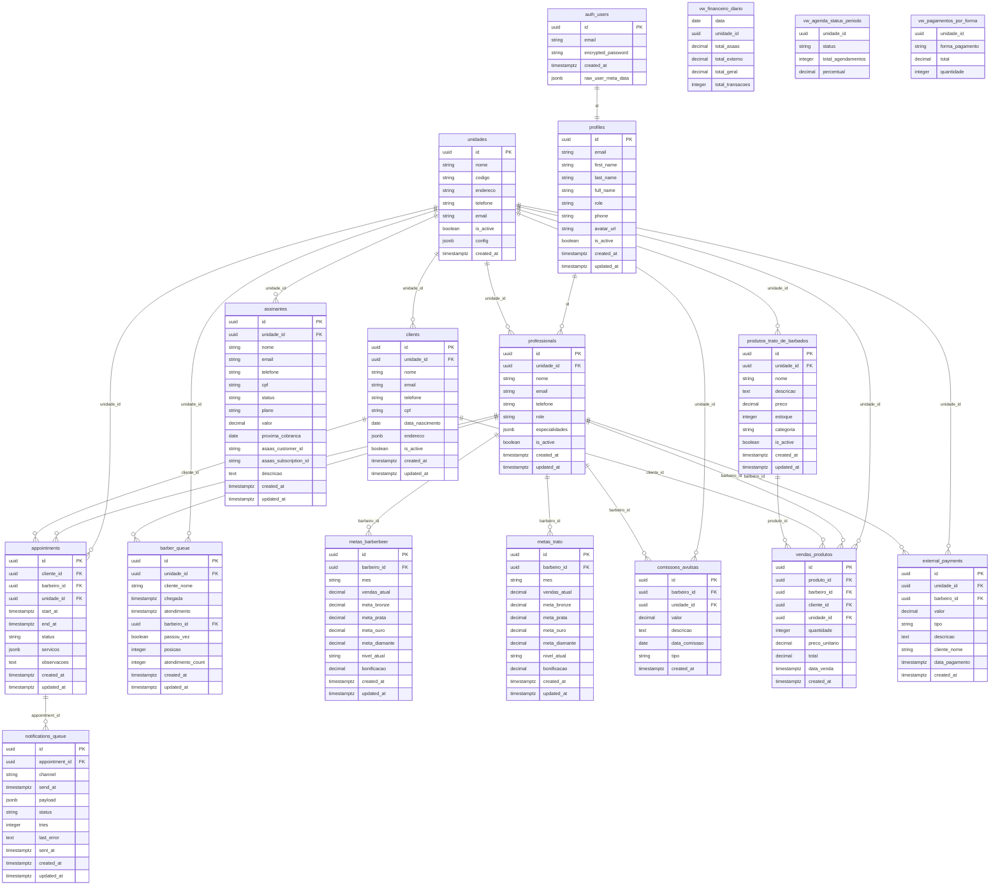

# 🗄️ Database - Estrutura e DER - Trato de Barbados

## 🎯 **Visão Geral do Banco**

O sistema utiliza **PostgreSQL** no **Supabase** com **Row Level Security (RLS)** para multi-tenancy. O banco está estruturado para suportar duas unidades (Trato e BarberBeer) com separação completa de dados.

---

## 📊 **Diagrama Entidade-Relacionamento (DER)**



---

## 📋 **Dicionário de Dados**

### **Tabelas de Autenticação**

#### `auth.users` (Supabase Auth)

| Coluna             | Tipo        | Descrição            | Constraints      |
| ------------------ | ----------- | -------------------- | ---------------- |
| id                 | UUID        | Identificador único  | PK               |
| email              | TEXT        | Email do usuário     | UNIQUE, NOT NULL |
| encrypted_password | TEXT        | Senha criptografada  | NOT NULL         |
| created_at         | TIMESTAMPTZ | Data de criação      | DEFAULT NOW()    |
| raw_user_meta_data | JSONB       | Metadados do usuário | -                |

#### `profiles`

| Coluna     | Tipo        | Descrição                          | Constraints                                                         |
| ---------- | ----------- | ---------------------------------- | ------------------------------------------------------------------- |
| id         | UUID        | Referência ao auth.users           | PK, FK                                                              |
| email      | TEXT        | Email (duplicado para performance) | -                                                                   |
| first_name | TEXT        | Primeiro nome                      | -                                                                   |
| last_name  | TEXT        | Sobrenome                          | -                                                                   |
| full_name  | TEXT        | Nome completo                      | -                                                                   |
| role       | TEXT        | Perfil do usuário                  | CHECK: admin, barbershop_owner, professional, recepcionista, client |
| phone      | TEXT        | Telefone                           | -                                                                   |
| avatar_url | TEXT        | URL do avatar                      | -                                                                   |
| is_active  | BOOLEAN     | Status ativo                       | DEFAULT true                                                        |
| created_at | TIMESTAMPTZ | Data de criação                    | DEFAULT NOW()                                                       |
| updated_at | TIMESTAMPTZ | Última atualização                 | DEFAULT NOW()                                                       |

### **Tabelas de Negócio**

#### `unidades`

| Coluna     | Tipo        | Descrição                 | Constraints   |
| ---------- | ----------- | ------------------------- | ------------- |
| id         | UUID        | Identificador único       | PK            |
| nome       | TEXT        | Nome da unidade           | NOT NULL      |
| codigo     | TEXT        | Código (TRATO, BBSC)      | UNIQUE        |
| endereco   | TEXT        | Endereço completo         | -             |
| telefone   | TEXT        | Telefone de contato       | -             |
| email      | TEXT        | Email institucional       | -             |
| is_active  | BOOLEAN     | Status ativo              | DEFAULT true  |
| config     | JSONB       | Configurações específicas | -             |
| created_at | TIMESTAMPTZ | Data de criação           | DEFAULT NOW() |

**Estrutura `config`:**

```json
{
  "commission_percent": 0.4,
  "colors": {
    "primary": "#22c55e",
    "secondary": "#ef4444"
  },
  "business_hours": {
    "open": "08:00",
    "close": "21:00"
  }
}
```

#### `professionals`

| Coluna         | Tipo        | Descrição               | Constraints                        |
| -------------- | ----------- | ----------------------- | ---------------------------------- |
| id             | UUID        | Identificador único     | PK                                 |
| unidade_id     | UUID        | Unidade do profissional | FK, NOT NULL                       |
| nome           | TEXT        | Nome completo           | NOT NULL                           |
| email          | TEXT        | Email profissional      | UNIQUE                             |
| telefone       | TEXT        | Telefone                | -                                  |
| role           | TEXT        | Tipo de profissional    | CHECK: professional, recepcionista |
| especialidades | JSONB       | Lista de especialidades | -                                  |
| is_active      | BOOLEAN     | Status ativo            | DEFAULT true                       |
| created_at     | TIMESTAMPTZ | Data de criação         | DEFAULT NOW()                      |
| updated_at     | TIMESTAMPTZ | Última atualização      | DEFAULT NOW()                      |

**Estrutura `especialidades`:**

```json
["corte", "barba", "sobrancelha", "tratamento"]
```

#### `appointments`

| Coluna      | Tipo        | Descrição                | Constraints                                                          |
| ----------- | ----------- | ------------------------ | -------------------------------------------------------------------- |
| id          | UUID        | Identificador único      | PK                                                                   |
| cliente_id  | UUID        | Cliente agendado         | FK                                                                   |
| barbeiro_id | UUID        | Profissional responsável | FK                                                                   |
| unidade_id  | UUID        | Unidade do agendamento   | FK, NOT NULL                                                         |
| start_at    | TIMESTAMPTZ | Data/hora início         | NOT NULL                                                             |
| end_at      | TIMESTAMPTZ | Data/hora fim            | NOT NULL                                                             |
| status      | TEXT        | Status do agendamento    | CHECK: agendado, confirmado, atendido, cancelado, no_show, bloqueado |
| servicos    | JSONB       | Serviços inclusos        | DEFAULT '[]'                                                         |
| observacoes | TEXT        | Observações gerais       | -                                                                    |
| created_at  | TIMESTAMPTZ | Data de criação          | DEFAULT NOW()                                                        |
| updated_at  | TIMESTAMPTZ | Última atualização       | DEFAULT NOW()                                                        |

**Estrutura `servicos`:**

```json
[
  {
    "id": "serv_001",
    "nome": "Corte + Barba",
    "duracao_minutos": 45,
    "preco": 50.0
  }
]
```

#### `barber_queue`

| Coluna            | Tipo        | Descrição               | Constraints   |
| ----------------- | ----------- | ----------------------- | ------------- |
| id                | UUID        | Identificador único     | PK            |
| unidade_id        | UUID        | Unidade da fila         | FK, NOT NULL  |
| cliente_nome      | TEXT        | Nome do cliente         | NOT NULL      |
| chegada           | TIMESTAMPTZ | Hora de chegada         | NOT NULL      |
| atendimento       | TIMESTAMPTZ | Hora do atendimento     | -             |
| barbeiro_id       | UUID        | Barbeiro que atendeu    | FK            |
| passou_vez        | BOOLEAN     | Passou a vez            | DEFAULT false |
| posicao           | INTEGER     | Posição na fila         | NOT NULL      |
| atendimento_count | INTEGER     | Qtd atendimentos do dia | DEFAULT 0     |
| created_at        | TIMESTAMPTZ | Data de criação         | DEFAULT NOW() |
| updated_at        | TIMESTAMPTZ | Última atualização      | DEFAULT NOW() |

#### `metas_trato` / `metas_barberbeer`

| Coluna        | Tipo          | Descrição                   | Constraints                          |
| ------------- | ------------- | --------------------------- | ------------------------------------ |
| id            | UUID          | Identificador único         | PK                                   |
| barbeiro_id   | UUID          | Profissional                | FK, NOT NULL                         |
| mes           | TEXT          | Mês de referência (YYYY-MM) | NOT NULL                             |
| vendas_atual  | DECIMAL(10,2) | Vendas do mês               | DEFAULT 0                            |
| meta_bronze   | DECIMAL(10,2) | Meta bronze (0-299)         | DEFAULT 300                          |
| meta_prata    | DECIMAL(10,2) | Meta prata (300-599)        | DEFAULT 600                          |
| meta_ouro     | DECIMAL(10,2) | Meta ouro (600-999)         | DEFAULT 900                          |
| meta_diamante | DECIMAL(10,2) | Meta diamante (1000+)       | DEFAULT 1200                         |
| nivel_atual   | TEXT          | Nível atingido              | CHECK: bronze, prata, ouro, diamante |
| bonificacao   | DECIMAL(10,2) | Valor da bonificação        | DEFAULT 0                            |
| created_at    | TIMESTAMPTZ   | Data de criação             | DEFAULT NOW()                        |
| updated_at    | TIMESTAMPTZ   | Última atualização          | DEFAULT NOW()                        |

---

## 🔒 **Row Level Security (RLS)**

### **Políticas Principais**

#### Política Multi-tenant

```sql
-- Função para unidade atual
CREATE OR REPLACE FUNCTION current_unidade()
RETURNS UUID AS $$
BEGIN
  RETURN (current_setting('app.current_unidade', true))::UUID;
END;
$$ LANGUAGE plpgsql;

-- Exemplo de política
CREATE POLICY "unidade_isolation" ON appointments
FOR ALL
USING (unidade_id = current_unidade());
```

#### Políticas por Role

```sql
-- Barbeiros veem apenas seus agendamentos
CREATE POLICY "barbeiro_appointments" ON appointments
FOR SELECT
USING (
  barbeiro_id = auth.uid() OR
  EXISTS (
    SELECT 1 FROM profiles
    WHERE id = auth.uid()
    AND role IN ('admin', 'recepcionista')
  )
);

-- Clientes veem apenas seus agendamentos
CREATE POLICY "cliente_appointments" ON appointments
FOR SELECT
USING (
  cliente_id = auth.uid() OR
  EXISTS (
    SELECT 1 FROM profiles
    WHERE id = auth.uid()
    AND role IN ('admin', 'barbershop_owner', 'recepcionista', 'professional')
  )
);
```

---

## 📊 **Views e Funções**

### **Views Materializadas**

#### `vw_financeiro_diario`

```sql
CREATE MATERIALIZED VIEW vw_financeiro_diario AS
SELECT
  DATE(created_at) as data,
  unidade_id,
  SUM(CASE WHEN fonte = 'asaas' THEN valor ELSE 0 END) as total_asaas,
  SUM(CASE WHEN fonte = 'externo' THEN valor ELSE 0 END) as total_externo,
  SUM(valor) as total_geral,
  COUNT(*) as total_transacoes
FROM (
  -- Assinaturas ASAAS
  SELECT created_at, unidade_id, valor, 'asaas' as fonte
  FROM assinantes
  WHERE status = 'ATIVO'

  UNION ALL

  -- Pagamentos externos
  SELECT created_at, unidade_id, valor, 'externo' as fonte
  FROM external_payments
) receitas
GROUP BY DATE(created_at), unidade_id;

-- Refresh diário
CREATE INDEX idx_vw_financeiro_data ON vw_financeiro_diario(data, unidade_id);
```

#### `vw_agenda_status_periodo`

```sql
CREATE MATERIALIZED VIEW vw_agenda_status_periodo AS
SELECT
  unidade_id,
  status,
  COUNT(*) as total_agendamentos,
  ROUND(COUNT(*) * 100.0 / SUM(COUNT(*)) OVER (PARTITION BY unidade_id), 2) as percentual
FROM appointments
WHERE start_at >= DATE_TRUNC('month', CURRENT_DATE)
GROUP BY unidade_id, status;
```

### **Funções Stored Procedures**

#### Notificações de Agendamento

```sql
CREATE OR REPLACE FUNCTION schedule_appointment_notifications(
  p_appointment_id UUID,
  p_channel TEXT DEFAULT 'whatsapp'
) RETURNS VOID AS $$
DECLARE
  v_appointment RECORD;
BEGIN
  -- Buscar agendamento
  SELECT * INTO v_appointment
  FROM appointments
  WHERE id = p_appointment_id;

  IF NOT FOUND THEN
    RAISE EXCEPTION 'Agendamento não encontrado';
  END IF;

  -- Cancelar notificações existentes
  UPDATE notifications_queue
  SET status = 'cancelled'
  WHERE appointment_id = p_appointment_id
    AND status = 'pending';

  -- Criar notificações (24h, 1h, 15min antes)
  INSERT INTO notifications_queue (appointment_id, channel, send_at, payload)
  VALUES
    (p_appointment_id, p_channel, v_appointment.start_at - INTERVAL '24 hours',
     jsonb_build_object('type', '24h_reminder', 'appointment_id', p_appointment_id)),
    (p_appointment_id, p_channel, v_appointment.start_at - INTERVAL '1 hour',
     jsonb_build_object('type', '1h_reminder', 'appointment_id', p_appointment_id)),
    (p_appointment_id, p_channel, v_appointment.start_at - INTERVAL '15 minutes',
     jsonb_build_object('type', '15min_reminder', 'appointment_id', p_appointment_id));
END;
$$ LANGUAGE plpgsql;
```

#### Reorganização da Fila

```sql
CREATE OR REPLACE FUNCTION reorganizar_fila_barbeiros(p_unidade_id UUID)
RETURNS VOID AS $$
BEGIN
  -- Reorganizar por número de atendimentos (menor primeiro)
  WITH fila_ordenada AS (
    SELECT id, ROW_NUMBER() OVER (
      ORDER BY
        CASE WHEN passou_vez THEN 1 ELSE 0 END,
        atendimento_count ASC,
        chegada ASC
    ) as nova_posicao
    FROM barber_queue
    WHERE unidade_id = p_unidade_id
      AND atendimento IS NULL
  )
  UPDATE barber_queue
  SET posicao = fo.nova_posicao
  FROM fila_ordenada fo
  WHERE barber_queue.id = fo.id;
END;
$$ LANGUAGE plpgsql;
```

---

## 🔧 **Índices e Performance**

### **Índices Principais**

```sql
-- Appointments
CREATE INDEX idx_appointments_barbeiro_date ON appointments(barbeiro_id, DATE(start_at));
CREATE INDEX idx_appointments_unidade_period ON appointments(unidade_id, start_at);
CREATE INDEX idx_appointments_status ON appointments(status) WHERE status != 'cancelado';

-- Barber Queue
CREATE INDEX idx_queue_unidade_posicao ON barber_queue(unidade_id, posicao);
CREATE INDEX idx_queue_atendimento ON barber_queue(atendimento) WHERE atendimento IS NULL;

-- Notifications
CREATE INDEX idx_notifications_pending ON notifications_queue(send_at, status)
WHERE status = 'pending';

-- Metas
CREATE INDEX idx_metas_barbeiro_mes ON metas_trato(barbeiro_id, mes);
CREATE INDEX idx_metas_barberbeer_mes ON metas_barberbeer(barbeiro_id, mes);

-- Search
CREATE INDEX idx_clients_search ON clients USING GIN(to_tsvector('portuguese', nome || ' ' || email));
CREATE INDEX idx_appointments_search ON appointments USING GIN(to_tsvector('portuguese', observacoes));
```

### **Particionamento (Futuro)**

```sql
-- Particionamento por mês para appointments (quando volume crescer)
CREATE TABLE appointments_2024_01 PARTITION OF appointments
FOR VALUES FROM ('2024-01-01') TO ('2024-02-01');

CREATE TABLE appointments_2024_02 PARTITION OF appointments
FOR VALUES FROM ('2024-02-01') TO ('2024-03-01');
```

---

## 📈 **Métricas e Monitoramento**

### **Queries de Monitoramento**

#### Performance de Queries

```sql
-- Top queries mais lentas
SELECT
  query,
  mean_exec_time,
  calls,
  total_exec_time
FROM pg_stat_statements
ORDER BY mean_exec_time DESC
LIMIT 10;
```

#### Uso de Índices

```sql
-- Índices não utilizados
SELECT
  schemaname,
  tablename,
  indexname,
  idx_scan,
  idx_tup_read,
  idx_tup_fetch
FROM pg_stat_user_indexes
WHERE idx_scan = 0;
```

#### Tamanho das Tabelas

```sql
-- Maiores tabelas
SELECT
  schemaname,
  tablename,
  pg_size_pretty(pg_total_relation_size(schemaname||'.'||tablename)) as size
FROM pg_tables
WHERE schemaname = 'public'
ORDER BY pg_total_relation_size(schemaname||'.'||tablename) DESC;
```

---

## ⚠️ **Pontos de Atenção**

### **Performance**

- **appointments**: Pode crescer rapidamente, considerar particionamento
- **notifications_queue**: Implementar cleanup de registros antigos
- **barber_queue**: Index em tempo real pode impactar performance

### **Backup e Recovery**

- **Supabase**: Backup automático, mas testar restore
- **Views Materializadas**: Refresh manual necessário
- **Dados Sensíveis**: CPF/telefones precisam de criptografia adicional

### **Escalabilidade**

- **RLS**: Pode impactar performance com muitos dados
- **JSONB**: Índices específicos para campos frequentes
- **Conexões**: Pool de conexões limitado no Supabase

### **Melhorias Recomendadas**

1. **Implementar audit trail** para mudanças críticas
2. **Adicionar constraints check** mais específicas
3. **Criar triggers** para validações complexas
4. **Implementar cache Redis** para queries frequentes

---

**Última atualização**: Dezembro 2024  
**Versão do Schema**: 1.0  
**SGBD**: PostgreSQL 15 (Supabase)
