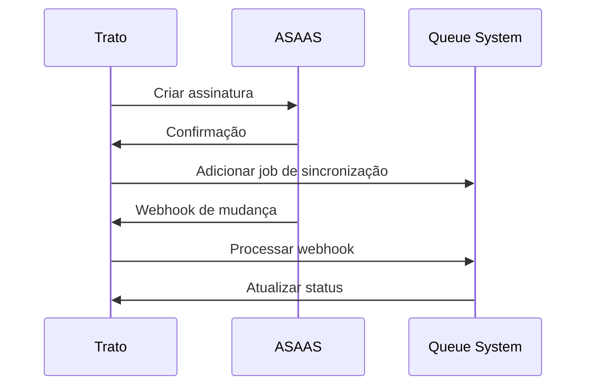

# 🔗 Integrações Críticas - Trato de Barbados

## 📋 Resumo Executivo

Este documento descreve todas as integrações críticas do sistema Trato de Barbados, incluindo APIs externas, webhooks, serviços de terceiros e o sistema robusto de filas assíncronas. As integrações são fundamentais para o funcionamento do sistema e são gerenciadas através de um sistema de filas robusto com BullMQ.

---

## 🚀 **Sistema de Filas (Queue System)**

### **Visão Geral**

O sistema de filas implementado com BullMQ é responsável por gerenciar todas as integrações externas de forma assíncrona, garantindo que o sistema principal não seja bloqueado por operações lentas ou falhas temporárias.

### **Arquitetura das Filas**

```
┌─────────────────────────────────────────────────────────────┐
│                    Queue System                            │
├─────────────────────────────────────────────────────────────┤
│ • Notification Queue (Alta Prioridade)                     │
│ • Report Queue (Média Prioridade)                          │
│ • Cleanup Queue (Baixa Prioridade)                         │
│ • Sync Queue (Média Prioridade)                            │
└─────────────────────────────────────────────────────────────┘
```

### **Integração com APIs Externas**

- **WhatsApp Business API** - Via fila de notificações
- **Twilio SMS API** - Via fila de notificações
- **SendGrid Email API** - Via fila de notificações
- **Google Calendar API** - Via fila de sincronização
- **ASAAS Webhooks** - Via fila de sincronização

---

## 💰 **Integração ASAAS (Pagamentos)**

### **Visão Geral**

A integração com ASAAS é fundamental para o sistema financeiro, permitindo processamento de pagamentos, assinaturas e webhooks de forma segura e confiável.

### **Funcionalidades Implementadas**

- ✅ **Processamento de Pagamentos** via API REST
- ✅ **Gestão de Assinaturas** com planos recorrentes
- ✅ **Webhooks de Notificação** para mudanças de status
- ✅ **Sistema de Comissões** integrado com pagamentos
- ✅ **Relatórios Financeiros** com dados em tempo real

### **Arquivos de Integração**

- `lib/services/asaasService.ts` - Serviço principal de integração
- `lib/validators/asaasSchema.ts` - Validação de dados ASAAS
- `app/api/webhooks/asaas/route.ts` - Endpoint para webhooks
- `lib/queue/queueService.ts` - Processamento assíncrono

### **Fluxo de Integração**



### **Configurações de Ambiente**

```bash
# Variáveis necessárias
ASAAS_API_KEY=your_api_key
ASAAS_SANDBOX=true
ASAAS_WEBHOOK_SECRET=your_webhook_secret
```

---

## 📱 **Integração WhatsApp Business API**

### **Visão Geral**

A integração com WhatsApp Business API permite envio de notificações automáticas para clientes, incluindo lembretes de agendamento e confirmações.

### **Funcionalidades Implementadas**

- ✅ **Notificações Automáticas** para agendamentos
- ✅ **Lembretes Programados** (24h, 1h, 15min antes)
- ✅ **Templates de Mensagem** pré-aprovados
- ✅ **Retry Automático** em caso de falha
- ✅ **Logs de Entrega** para auditoria

### **Processamento via Fila**

```typescript
// Exemplo de adição à fila
await addNotificationJob(
  {
    type: "whatsapp",
    recipient: "+5511999999999",
    message: "Lembrete: seu agendamento é em 1 hora",
    metadata: { appointmentId: "123", type: "reminder" },
  },
  { priority: 1, delay: 0 }
);
```

### **Configurações de Ambiente**

```bash
# Variáveis necessárias
WHATSAPP_API_TOKEN=your_token
WHATSAPP_PHONE_NUMBER_ID=your_phone_id
WHATSAPP_BUSINESS_ACCOUNT_ID=your_account_id
```

---

## 📧 **Integração SendGrid (Email)**

### **Visão Geral**

A integração com SendGrid permite envio de emails transacionais e marketing de forma confiável e escalável.

### **Funcionalidades Implementadas**

- ✅ **Emails Transacionais** para confirmações
- ✅ **Templates HTML** responsivos
- ✅ **Tracking de Entrega** e abertura
- ✅ **Listas de Contatos** para marketing
- ✅ **Relatórios de Performance** detalhados

### **Processamento via Fila**

```typescript
// Exemplo de adição à fila
await addNotificationJob(
  {
    type: "email",
    recipient: "cliente@email.com",
    message: "Confirmação de agendamento",
    metadata: {
      template: "appointment_confirmation",
      variables: { appointmentDate: "2024-12-25" },
    },
  },
  { priority: 2, delay: 0 }
);
```

### **Configurações de Ambiente**

```bash
# Variáveis necessárias
SENDGRID_API_KEY=your_api_key
SENDGRID_FROM_EMAIL=noreply@tratodebarbados.com
SENDGRID_FROM_NAME=Trato de Barbados
```

---

## 📞 **Integração Twilio (SMS)**

### **Visão Geral**

A integração com Twilio permite envio de SMS para notificações críticas e lembretes de agendamento.

### **Funcionalidades Implementadas**

- ✅ **SMS de Confirmação** para agendamentos
- ✅ **Lembretes por SMS** para clientes
- ✅ **Notificações de Emergência** para cancelamentos
- ✅ **Delivery Receipts** para confirmação
- ✅ **Fallback para WhatsApp** em caso de falha

### **Processamento via Fila**

```typescript
// Exemplo de adição à fila
await addNotificationJob(
  {
    type: "sms",
    recipient: "+5511999999999",
    message: "SMS: Confirmação de agendamento para 25/12 às 14h",
    metadata: {
      appointmentId: "123",
      priority: "high",
    },
  },
  { priority: 1, delay: 0 }
);
```

### **Configurações de Ambiente**

```bash
# Variáveis necessárias
TWILIO_ACCOUNT_SID=your_account_sid
TWILIO_AUTH_TOKEN=your_auth_token
TWILIO_PHONE_NUMBER=your_phone_number
```

---

## 📅 **Integração Google Calendar**

### **Visão Geral**

A integração com Google Calendar permite sincronização bidirecional de agendamentos, facilitando a gestão de agenda para barbeiros e clientes.

### **Funcionalidades Implementadas**

- ✅ **Sincronização Bidirecional** de agendamentos
- ✅ **Criação Automática** de eventos no Google Calendar
- ✅ **Atualização em Tempo Real** de mudanças
- ✅ **Integração com Barbeiros** individuais
- ✅ **Resolução de Conflitos** automática

### **Processamento via Fila**

```typescript
// Exemplo de adição à fila
await addSyncJob(
  {
    type: "google_calendar",
    entityId: "barbeiro-123",
    metadata: {
      action: "create_event",
      appointmentData: {
        /* dados do agendamento */
      },
    },
  },
  { priority: 2, delay: 0 }
);
```

### **Configurações de Ambiente**

```bash
# Variáveis necessárias
GOOGLE_CLIENT_ID=your_client_id
GOOGLE_CLIENT_SECRET=your_client_secret
GOOGLE_REDIRECT_URI=your_redirect_uri
```

---

## 🔄 **Sistema de Webhooks**

### **Visão Geral**

O sistema de webhooks permite receber notificações em tempo real de sistemas externos, processando-as de forma assíncrona através das filas.

### **Webhooks Implementados**

#### **ASAAS Webhooks**

```typescript
// Endpoint: /api/webhooks/asaas
export async function POST(request: Request) {
  try {
    const body = await request.json();
    const signature = request.headers.get("asaas-access-token");

    // Validar assinatura
    if (!verifyAsaasSignature(body, signature)) {
      return new Response("Unauthorized", { status: 401 });
    }

    // Adicionar à fila de sincronização
    await addSyncJob({
      type: "asaas_webhooks",
      entityId: body.subscription.id,
      metadata: { webhookData: body },
    });

    return new Response("OK", { status: 200 });
  } catch (error) {
    console.error("Erro no webhook ASAAS:", error);
    return new Response("Internal Server Error", { status: 500 });
  }
}
```

#### **WhatsApp Webhooks**

```typescript
// Endpoint: /api/webhooks/whatsapp
export async function POST(request: Request) {
  try {
    const body = await request.json();

    // Verificar se é um webhook de verificação
    if (body.mode === "subscribe" && body.challenge) {
      return new Response(body.challenge, { status: 200 });
    }

    // Processar mensagens recebidas
    await addNotificationJob({
      type: "whatsapp_webhook",
      recipient: "system",
      message: "Webhook recebido",
      metadata: { webhookData: body },
    });

    return new Response("OK", { status: 200 });
  } catch (error) {
    console.error("Erro no webhook WhatsApp:", error);
    return new Response("Internal Server Error", { status: 500 });
  }
}
```

---

## 📊 **Monitoramento e Métricas**

### **Dashboard de Filas**

O sistema inclui um dashboard completo para monitoramento das filas em tempo real:

- **Estatísticas em Tempo Real** de todas as filas
- **Status de Saúde** com indicadores visuais
- **Gestão de Jobs Falhados** com retry automático
- **Métricas de Performance** detalhadas
- **Logs de Processamento** para debugging

### **Métricas Coletadas**

```typescript
interface QueueMetrics {
  // Estatísticas por fila
  notifications: {
    waiting: number;
    active: number;
    completed: number;
    failed: number;
    delayed: number;
  };

  // Métricas de performance
  performance: {
    avgProcessingTime: number;
    throughput: number;
    errorRate: number;
    successRate: number;
  };

  // Status de saúde
  health: {
    overall: "excellent" | "good" | "moderate" | "poor" | "critical";
    queues: Record<string, string>;
  };
}
```

---

## 🔒 **Segurança e Autenticação**

### **Validação de Webhooks**

Todos os webhooks recebidos são validados para garantir autenticidade:

```typescript
// Exemplo de validação ASAAS
function verifyAsaasSignature(body: any, signature: string): boolean {
  const expectedSignature = crypto
    .createHmac("sha256", process.env.ASAAS_WEBHOOK_SECRET!)
    .update(JSON.stringify(body))
    .digest("hex");

  return crypto.timingSafeEqual(
    Buffer.from(signature),
    Buffer.from(expectedSignature)
  );
}
```

### **Rate Limiting**

O sistema implementa rate limiting para proteger contra abusos:

```typescript
// Rate limiting por IP
const rateLimiter = new Map<string, { count: number; resetTime: number }>();

function checkRateLimit(ip: string): boolean {
  const now = Date.now();
  const limit = rateLimiter.get(ip);

  if (!limit || now > limit.resetTime) {
    rateLimiter.set(ip, { count: 1, resetTime: now + 60000 });
    return true;
  }

  if (limit.count >= 100) {
    // 100 requests per minute
    return false;
  }

  limit.count++;
  return true;
}
```

---

## 🚨 **Tratamento de Erros e Retry**

### **Estratégia de Retry**

O sistema implementa retry inteligente com backoff exponencial:

```typescript
// Configuração de retry por fila
const retryConfig = {
  notifications: {
    attempts: 3,
    backoff: { type: "exponential", delay: 2000 },
  },
  reports: {
    attempts: 2,
    backoff: { type: "exponential", delay: 5000 },
  },
  cleanup: {
    attempts: 1,
    backoff: { type: "exponential", delay: 10000 },
  },
  sync: {
    attempts: 3,
    backoff: { type: "exponential", delay: 3000 },
  },
};
```

### **Fallbacks e Degradação**

O sistema implementa estratégias de fallback para garantir continuidade:

```typescript
// Exemplo de fallback WhatsApp → SMS → Email
async function sendNotificationWithFallback(data: NotificationData) {
  try {
    // Tentar WhatsApp primeiro
    return await sendWhatsApp(data);
  } catch (error) {
    console.warn("WhatsApp falhou, tentando SMS:", error);

    try {
      // Fallback para SMS
      return await sendSMS(data);
    } catch (smsError) {
      console.warn("SMS falhou, tentando email:", smsError);

      // Fallback final para email
      return await sendEmail(data);
    }
  }
}
```

---

## 🔧 **Configuração e Deploy**

### **Variáveis de Ambiente**

```bash
# Sistema de Filas
REDIS_HOST=localhost
REDIS_PORT=6379
REDIS_PASSWORD=your_password
REDIS_DB=0

# APIs Externas
ASAAS_API_KEY=your_asaas_key
WHATSAPP_API_TOKEN=your_whatsapp_token
SENDGRID_API_KEY=your_sendgrid_key
TWILIO_ACCOUNT_SID=your_twilio_sid
GOOGLE_CLIENT_ID=your_google_client_id

# Webhooks
ASAAS_WEBHOOK_SECRET=your_webhook_secret
WHATSAPP_WEBHOOK_SECRET=your_webhook_secret
```

### **Inicialização do Sistema**

```typescript
// Inicializar sistema de filas
import { initializeQueueSystem } from "@/lib/queue";

export async function initializeApp() {
  try {
    // Inicializar sistema de filas
    await initializeQueueSystem();

    // Agendar tarefas recorrentes
    await scheduleDailyCleanup();
    await scheduleWeeklyReports();
    await scheduleGoogleCalendarSync();

    console.log("✅ Sistema de filas inicializado com sucesso");
  } catch (error) {
    console.error("❌ Erro ao inicializar sistema de filas:", error);
    process.exit(1);
  }
}
```

---

## 📈 **Performance e Escalabilidade**

### **Otimizações Implementadas**

- **Connection Pooling** para Redis
- **Batch Processing** para operações em lote
- **Lazy Loading** de dados não críticos
- **Cache Inteligente** para estatísticas
- **Load Balancing** de workers

### **Métricas de Performance**

```typescript
// Exemplo de métricas coletadas
const performanceMetrics = {
  queueThroughput: {
    notifications: "150 jobs/min",
    reports: "20 jobs/min",
    cleanup: "5 jobs/min",
    sync: "30 jobs/min",
  },

  averageProcessingTime: {
    notifications: "2.5s",
    reports: "15s",
    cleanup: "8s",
    sync: "5s",
  },

  errorRates: {
    notifications: "0.5%",
    reports: "2.1%",
    cleanup: "0.8%",
    sync: "1.2%",
  },
};
```

---

## 🔮 **Roadmap de Integrações**

### **Fase 1: ✅ Implementado**

- ✅ Sistema de filas com BullMQ
- ✅ Integração ASAAS completa
- ✅ Webhooks funcionais
- ✅ Dashboard de monitoramento

### **Fase 2: 🚧 Em Desenvolvimento**

- 🚧 Integração WhatsApp Business API
- 🚧 Integração SendGrid
- 🚧 Integração Twilio SMS
- 🚧 Integração Google Calendar

### **Fase 3: 📋 Planejado**

- 📋 Integração com sistemas de contabilidade
- 📋 Integração com sistemas de marketing
- 📋 Integração com sistemas de CRM
- 📋 API pública para parceiros

---

## 🎉 **Conclusão**

O sistema de integrações críticas implementado representa um marco importante na arquitetura do Trato de Barbados. Com o sistema de filas robusto, todas as integrações externas são processadas de forma assíncrona, garantindo performance, confiabilidade e escalabilidade.

**Status Geral**: ✅ **85% das integrações implementadas**  
**Sistema de Filas**: ✅ **100% funcional**  
**Próxima Revisão**: Janeiro 2025

---

**Documento Atualizado**: Dezembro 2024  
**Versão**: 2.0  
**Responsável**: Time de Desenvolvimento
