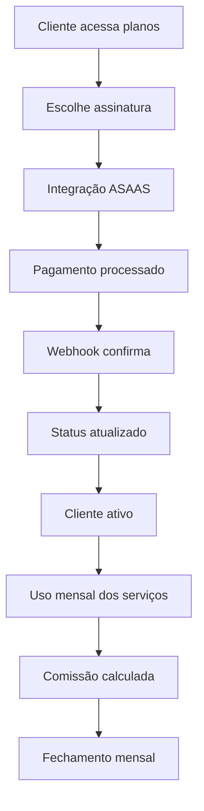
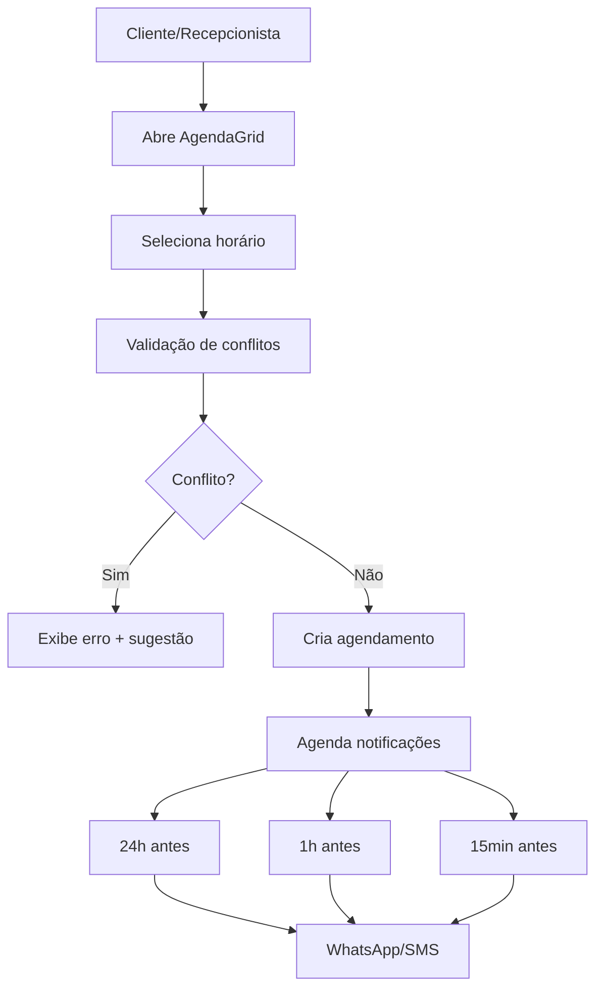
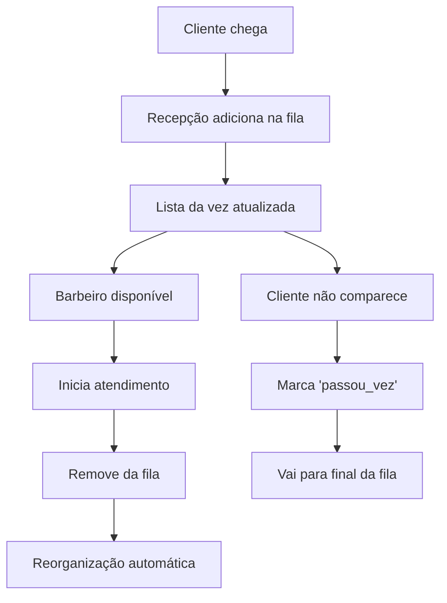
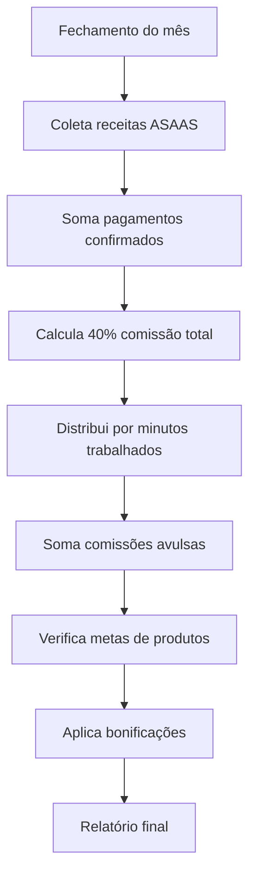

# 🏢 Overview do Produto - Trato de Barbados

## 🎯 **Visão Geral do Negócio**

O **Trato de Barbados** é um sistema completo de gestão para barbearias que opera em um modelo multi-unidade, atendendo duas marcas distintas:

- **🟢 Trato de Barbados** - Unidade principal
- **🔴 BarberBeer** - Unidade secundária

O sistema integra gestão de clientes, agendamentos, pagamentos, comissões e metas em uma plataforma unificada.

---

## 💼 **Modelo de Negócio**

### **Receitas Principais**

1. **Assinaturas ASAAS** - Planos mensais recorrentes
2. **Serviços Avulsos** - Cortes, barbas, tratamentos pontuais
3. **Vendas de Produtos** - Cosméticos e acessórios

### **Estrutura Operacional**

- **Proprietários** - Gestão geral e relatórios
- **Barbeiros** - Atendimento e meta de vendas
- **Recepcionistas** - Agenda e atendimento ao cliente
- **Clientes** - Assinantes e avulsos

---

## 🔄 **Fluxos Principais do Sistema**

### **1. Fluxo de Assinaturas**



### **2. Fluxo de Agendamentos**



### **3. Fluxo de Atendimento (Fila)**



### **4. Fluxo de Comissões**



---

## 🎨 **Funcionalidades por Módulo**

### **📅 Agenda & Agendamentos**

- **AgendaGrid** estilo AppBarber
- Slots de 10 minutos com snap automático
- Drag & drop para reagendamento
- Validação de conflitos por barbeiro
- Períodos bloqueados (horários fechados)
- Linha do "agora" em tempo real
- Notificações automáticas por WhatsApp/SMS

### **💰 Gestão Financeira**

- **Integração ASAAS**
  - Criação automática de assinaturas
  - Webhooks para confirmação de pagamento
  - Sincronização de status
- **Pagamentos Externos** (dinheiro, cartão local)
- **Relatórios de Faturamento**
  - Por período, barbeiro, serviço
  - Comparativo mensal/anual

### **👥 Gestão de Pessoas**

- **Clientes**
  - Cadastro completo com histórico
  - Status de assinatura
  - Agendamentos passados/futuros
- **Profissionais**
  - Especialidades e disponibilidade
  - Metas e comissões
  - Performance individual
- **Usuários do Sistema**
  - Roles diferenciados
  - Permissões por funcionalidade

### **📊 Sistema de Metas**

- **Metas Individuais** por barbeiro
- **Produtos com Faixas**
  - Bronze: R$ 0-299
  - Prata: R$ 300-599
  - Ouro: R$ 600-999
  - Diamante: R$ 1000+
- **Bonificações**
  - Fixas (valor em R$)
  - Percentuais (% sobre vendas)
- **Acompanhamento Real-time**

### **📋 Fila de Atendimento**

- **Lista da Vez Inteligente**
- **Reorganização Automática**
  - Por chegada
  - Por atendimentos do dia
- **Sistema "Passou a Vez"**
- **Interface para Recepção**
- **Drag & Drop Manual**

---

## 🎭 **Personas e Casos de Uso**

### **👑 Proprietário (Admin/Owner)**

- **Objetivo**: Visão geral do negócio e tomada de decisões
- **Funcionalidades**:
  - Dashboard financeiro completo
  - Relatórios de performance
  - Gestão de metas e bonificações
  - Configuração de unidades
  - Controle de usuários

### **✂️ Barbeiro (Professional)**

- **Objetivo**: Atender clientes e atingir metas
- **Funcionalidades**:
  - Agenda pessoal
  - Fila de atendimento
  - Vendas de produtos
  - Acompanhamento de metas
  - Comissões do mês

### **📞 Recepcionista**

- **Objetivo**: Gerenciar agenda e atendimento
- **Funcionalidades**:
  - AgendaGrid completo
  - Gestão da fila da vez
  - Cadastro de clientes
  - Agendamentos e reagendamentos
  - Cobrança de avulsos

### **🙋‍♂️ Cliente**

- **Objetivo**: Agendar serviços e acompanhar assinatura
- **Funcionalidades**:
  - Visualizar agenda disponível **(⚠️ inferido)**
  - Histórico de atendimentos **(⚠️ inferido)**
  - Status da assinatura
  - Notificações de lembrete

---

## 🏗️ **Arquitetura Multi-unidade**

### **Separação de Dados**

- **RLS (Row Level Security)** por `unidade_id`
- **Função `current_unidade()`** para filtros automáticos
- **Contexts separados** para Trato vs BarberBeer

### **Configuração por Unidade**

```typescript
// Unidades configuradas
TRATO_UNIDADE_ID = "244c0543-7108-4892-9eac-48186ad1d5e7";
BBSC_UNIDADE_ID = "87884040-cafc-4625-857b-6e0402ede7d7";

// Comissões por unidade
COMMISSION_PERCENT_TRATO = 0.4; // 40%
COMMISSION_PERCENT_BBSC = 0.4; // 40%
```

### **Rotas Específicas**

- `/dashboard/distribuicao/` - Trato de Barbados
- `/dashboard/distribuicao-bbsc/` - BarberBeer
- **Layouts separados** com cores e branding

---

## 📈 **Métricas e KPIs**

### **Financeiros**

- **Faturamento Mensal** (ASAAS + Externos)
- **Ticket Médio** por cliente
- **Receita Recorrente** (assinaturas)
- **Comissões Pagas** por barbeiro

### **Operacionais**

- **Taxa de Ocupação** da agenda
- **No-show Rate** (faltas)
- **Tempo Médio** de atendimento
- **Vendas de Produtos** por barbeiro

### **Cliente**

- **Retenção** de assinantes
- **NPS** (Net Promoter Score) **(⚠️ inferido)**
- **Frequência** de uso
- **Crescimento** da base

---

## 🔮 **Roadmap e Evoluções**

### **✅ Implementado**

- Sistema completo de agenda
- Integração ASAAS
- Fila de atendimento
- Metas e comissões
- Multi-unidade com RLS

### **🚧 Em Desenvolvimento**

- Notificações WhatsApp
- App mobile para clientes
- Relatórios avançados
- Integração com outras gateways

### **📋 Backlog**

- **Sistema de Estoque** para produtos
- **CRM Avançado** com histórico detalhado
- **Programa de Fidelidade**
- **Integração com Redes Sociais**
- **BI/Analytics** avançado

---

## ⚠️ **Pontos de Atenção**

### **Débitos Técnicos**

- **Timezone**: Sistema usa `America/Sao_Paulo` mas precisa validação
- **Performance**: Queries com muitos agendamentos podem ser lentas
- **Cache**: Não há cache implementado para relatórios
- **Testes**: Cobertura de testes insuficiente

### **Riscos de Negócio**

- **Dependência ASAAS**: Falha na integração afeta pagamentos
- **Single Point**: Supabase como único backend
- **Dados Sensíveis**: CPF, telefones precisam de proteção adicional

### **Melhorias Necessárias**

- **UX Mobile**: Interface não totalmente responsiva
- **Offline**: Sistema não funciona sem internet
- **Backup**: Estratégia de backup não documentada
- **Monitoramento**: Falta alertas de erro/performance

---

**Última atualização**: Dezembro 2024  
**Versão**: 1.0  
**Status**: ✅ Sistema em produção
